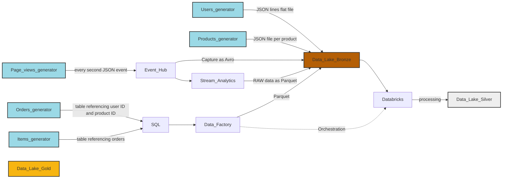
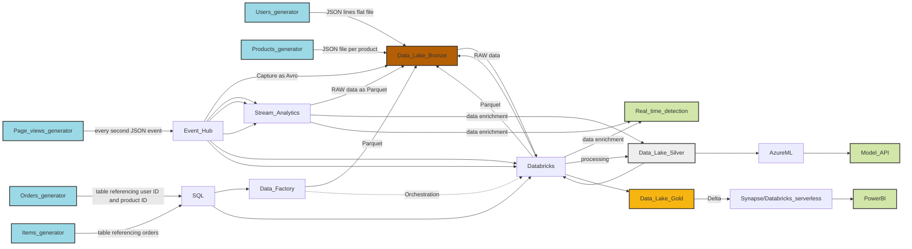

# Data playground
This repo contains my data learning project. In order to play with enough data I have developed containerized generators and streamers to have data stored in different ways or streamed. In next phase I will add steps to prepare and consolidate data followed by different types of analysis and visualizations.

**Whole playground is designed to be completely automated with no prior dependencies. By running single Terraform template everything should get deployed, generators, streamers and other software started as containers hosted in Azure and Databrics, Synapse or Data Factory configurations pushed using proper Terraform providers or via Git references.**

## Deployment
Go to terraform folder and run it. Note that generators are started as Azure Container Instances and might take few hours to complete. In main.tf when calling modules you can modify certain inputs such as ammount of data generated.

```bash
cd terraform
az login
terraform init
terraform apply -auto-approve
```

## Current architecture


## Possible target architecture (TBD)


## Data generation
Data generation module deploys following resources together with containers responsible for data generation and streaming:
- Azure Storage Data Lake gen2
- Azure Event Hub
- Azure SQL
- Data generators and streamers

Data sources:
- Users (JSON lines single flat file) in Azure Storage Data Lake gen2
- Products (JSON file per product) in Azure Storage Data Lake gen2
- Page views (data stream) streamed via Azure Event Hub
- Orders (relational tables) stored as orders and items tables in Azure SQL

See [datageneration](datageneration/datageneration.md) for more details.

## Data preparation and movement
This part contains consolidation of data sources into bronze tier and potentialy some manipulations and preparation.

- Data Factory gets deployed by Terraform with
  - Linked services
    - Key Vault service authenticated via User Managed Identity
    - SQL service with secrets stored in Key Vault
    - Data Lake gen2 service authenticated via User Managed Identity
  - Datasets
    - order and items tables in SQL (source)
    - order and items as Parquet files in Data Lake gen2 (sink)
  - Pipelines
    - Copy operation triggered every hour from SQL tables to Data Lake
- Stream Analytics getting pageviews stream to bronze tier as Parquet files
- Event Hub data capture to bronze tier as Avro files
- Databricks processing orchestrated by Data Factory
  - Two clusters - single node and serverless
  - Notebook to get data from bronze tier and create Delta tables in silver tier
  - Data movement from SQL do bronze tier and coordinated run of Databricks notebook is orchestrated via Data Factory pipeline
  
## Data analysis (all TBD)
- Stream Analytics enriching pageviews data with customer information
- Azure Databricks advanced processing, visualization and ML
- PowerBI dashboard to visualize data (+ using Synapse or Databricks serverless to read Delta from data lake)
- AzureML training model using data processed by Databricks
