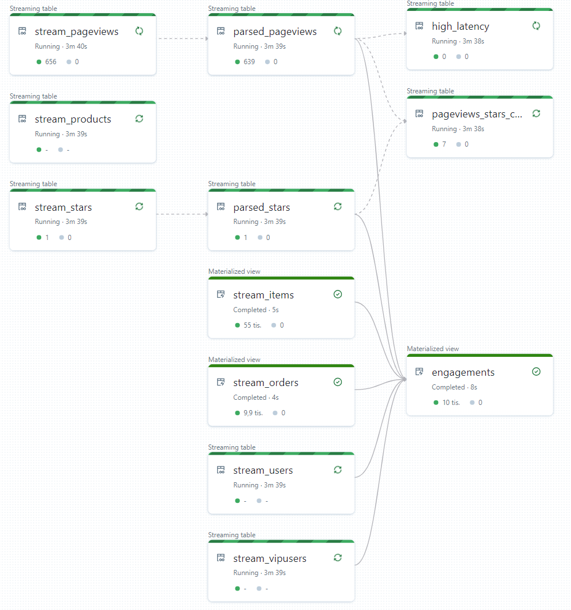

# Data playground
This repo contains my data learning project. In order to play with enough data I have developed containerized generators and streamers to have data stored in different ways or streamed. In next phase I will add steps to prepare and consolidate data followed by different types of analysis and visualizations.

**Whole playground is designed to be completely automated with no prior dependencies. By running single Terraform template everything should get deployed, generators, streamers and other software started as containers hosted in Azure and Databrics, Synapse or Data Factory configurations pushed using proper Terraform providers or via Git references.**

Basic data playground is packaged as reusable module (data lake, generators, SQL database) on top of which two solutions are built and can be deployed separately:
- Databricks solution -> End goal is using Databricks for ETL, stream processing, analytics and visualization
- Microsoft solution -> End goal is using Synapse for ETL and analytics, Stream Analytics for streaming and PowerBI for visualization

## Deployment
Go to terraform folder and run it. Note that generators are started as Azure Container Instances and might take few hours to complete. In main.tf when calling modules you can modify certain inputs such as ammount of data generated.

```bash
cd terraform
cd databricks_solution   # or microsoft_solution
az login
terraform init
terraform apply -auto-approve
```

## Data generation
Data generation module deploys following resources together with containers responsible for data generation and streaming:
- Azure Storage Data Lake gen2
- Azure Event Hub
- Azure SQL
- Data generators and streamers

Data sources:
- Users (JSON lines single flat file) in Azure Storage Data Lake gen2
- Products (JSON file per product) in Azure Storage Data Lake gen2
- Page views (data stream) and stars (another stream) streamed via Azure Event Hub
- Orders (relational tables) stored as orders and items tables in Azure SQL

See [datageneration](datageneration/datageneration.md) for more details.

## Microsoft solution
- Synapse is deployed
- Stream Analytics getting raw pageviews and stars stream to bronze tier as Parquet files
- Data processed from bronze tier and Azure SQL into Delta Tables in silver tier using DataFlow and Pipeline
- BI table is generated into gold tier by aggregating data from all sources into Parquet files
- Simple PowerBI dashboard
- Stream Analytics enrichment scenarios (output as files to silver tier)
  - Alert on high latency requests
  - Enriching pageviews data with customer information for high latency requests
  - Aggregating pageviews by HTTP method in 5 minutes window
  - Alerting on VIP users access (by looking up vip.json)
  - Correlating two streams (pageviews of users who also gave star over last 15 minutes)

For TBD see [GitHub Issues](https://github.com/tkubica12/dataplayground/issues?q=is%3Aissue+is%3Aopen+label%3AMicrosoft)

## Databricks solution
- Workspace deployed with cluster definitions
- Unity Catalog using managed identity to access storage layer
- Traditional workflow:
  - Using auto-loader to get data from bronze tier to managed Unity Catalog tables (users, vipusers and products)
  - Usign job to ingest data from SQL (orders and items)
  - BI table into gold tier (scheduled as job)
- Delta Live Tables
  - Pure streaming scenario
    - Processing raw Kafka events from Event Hub
    - Parsing stream (decode base64 and parse JSON)
    - Correlate two streams
    - Identify high latency pageviews
  - Materialized view - engagements table
    - Ingest data directly from SQL (orders and items)
    - Ingest data from storage (users, vipusers and products)
    - Combine all sources to create aggregated engagements table

For TBD see [GitHub Issues](https://github.com/tkubica12/dataplayground/issues?q=is%3Aissue+is%3Aopen+label%3ADatabricks)

Inputs - there are few input variables you can pass (see inputs.tf):
- location (westeurope if not changed)
- existing_metastore_id (if you want to use existing metastore as currently Databricks supports only one per region, otherwise new one will be created)

Stream processing pipeline:


## My notes for certifications
- [Databricks ML Associate](notes/Databricks%20ML%20associate/README.md)
- [Databricks Data Engineer Associate](notes/Databricks%20Data%20Engineer%20Associate/README.md)